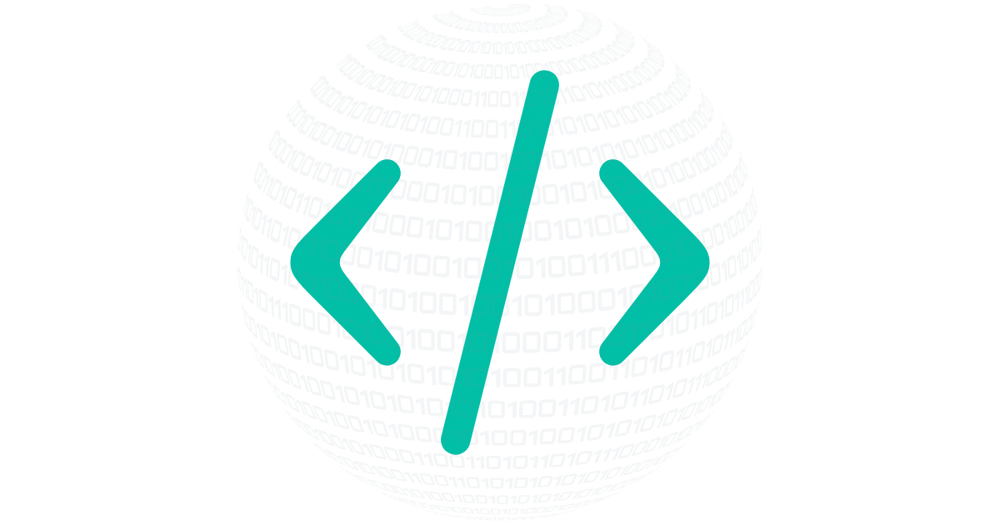

# KP_Code — Portfolio



Monorepo with **50 website templates** (10 industries × 5 projects each).  
Every project is self-contained and organized by **industry → tech stack → project**.  
Deployed on **Netlify** for live demos, with source code versioned on **GitHub**.

---

## 🌐 Live Demos (Netlify)

-  [Construction — Project 01](https://construction-project-01.netlify.app)
-  [Construction — Project 02](https://construction-project-02.netlify.app)
-  [Gastronomy — Project 01](https://gastronomy-project-01.netlify.app)
-  [Gastronomy — Project 02](https://gastronomy-project-02.netlify.app)
-  [Tourism — Project 01](https://tourism-project-01.netlify.app)

*(more projects coming soon…)*

---

## 📂 Repository Structure

```
kp_code-portfolio/
├─ construction/          # Industry 01
│  ├─ html-css-js/        project-01 … project-05
│  ├─ tailwind/           project-01 … project-05
│  ├─ react/              project-01 … project-05
│  ├─ nextjs-shadcn/      project-01 … project-05
│  └─ fullstack/          project-01 … project-05
│
├─ gastronomy/            # Industry 02
│  ├─ html-css-js/ … ├─ tailwind/ … ├─ react/ …  
│  ├─ nextjs-shadcn/ … └─ fullstack/ …
│
├─ ecommerce/             # Industry 03
│  ├─ html-css-js/ … ├─ tailwind/ … ├─ react/ …  
│  ├─ nextjs-shadcn/ … └─ fullstack/ …
│
├─ education/             # Industry 04
│  ├─ html-css-js/ … ├─ tailwind/ … ├─ react/ …  
│  ├─ nextjs-shadcn/ … └─ fullstack/ …
│
├─ healthcare/            # Industry 05
│  ├─ html-css-js/ … ├─ tailwind/ … ├─ react/ …  
│  ├─ nextjs-shadcn/ … └─ fullstack/ …
│
├─ transport/             # Industry 06
│  ├─ html-css-js/ … ├─ tailwind/ … ├─ react/ …  
│  ├─ nextjs-shadcn/ … └─ fullstack/ …
│
├─ it-software/           # Industry 07
│  ├─ html-css-js/ … ├─ tailwind/ … ├─ react/ …  
│  ├─ nextjs-shadcn/ … └─ fullstack/ …
│
├─ tourism/               # Industry 08
│  ├─ html-css-js/ … ├─ tailwind/ … ├─ react/ …  
│  ├─ nextjs-shadcn/ … └─ fullstack/ …
│
├─ fashion-beauty/        # Industry 09
│  ├─ html-css-js/ … ├─ tailwind/ … ├─ react/ …  
│  ├─ nextjs-shadcn/ … └─ fullstack/ …
│
└─ creative-services/     # Industry 10
   ├─ html-css-js/ … ├─ tailwind/ … ├─ react/ …  
   ├─ nextjs-shadcn/ … └─ fullstack/ …
```

---

## 🖥 How to Run Locally

### HTML / Tailwind
```bash
# open index.html in your browser
```

### React
```bash
npm install
npm run dev
```

### Next.js (with shadcn/ui or Fullstack)
```bash
npm install
npm run dev

# production build
npm run build && npm start
```

---

## 🗺 Desc.

1–2️⃣ **HTML/CSS/JS** → Fundamentals & first portfolio projects  
3️⃣ **Tailwind CSS** → Rapid prototyping with utility classes  
4️⃣ **React** → Component-based development  
5️⃣ **Next.js + shadcn/ui** → Modern SSR/SSG apps with UI components  
6️⃣ **Full-stack basics** → REST APIs, databases, deployments  

Planned industries:  
Construction, Gastronomy, E-commerce, Education, Healthcare, Transport, IT & Software, Tourism, Fashion & Beauty, Creative Services.

---

## 📏 Conventions

- **Commits:**  
  - `feat:` new feature/page  
  - `fix:` bugfix  
  - `chore:` tooling/cleanup  
  - `docs:` documentation  
  Example:  
  ```
  feat(gastronomy/project-01): add hero & menu sections
  ```

- **Folders:** lowercase, English, hyphenated  
  Example: `renovation-team`, `restaurant-aurelia`

---

## 📜 License

MIT © [kpkrol85](https://github.com/kpkrol85)
